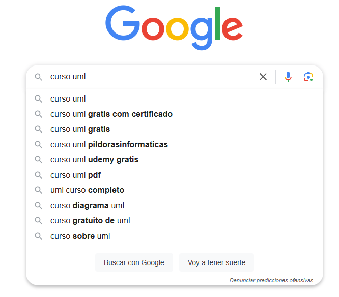
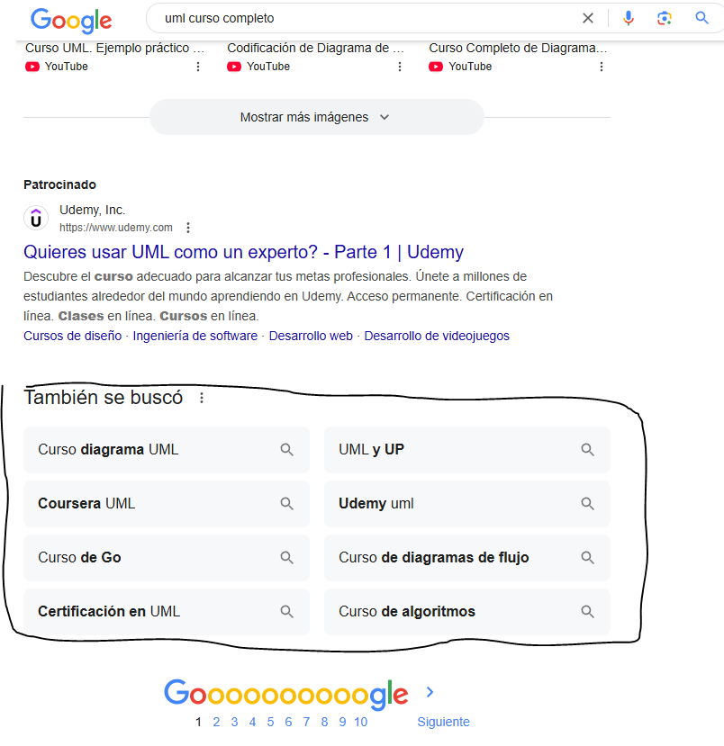
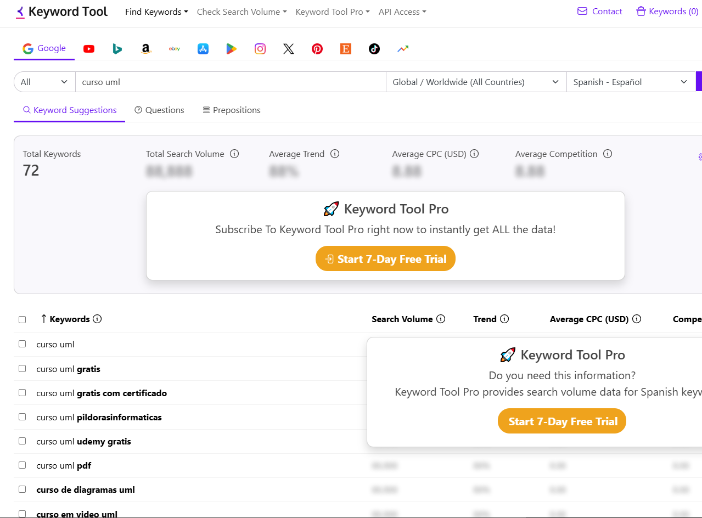
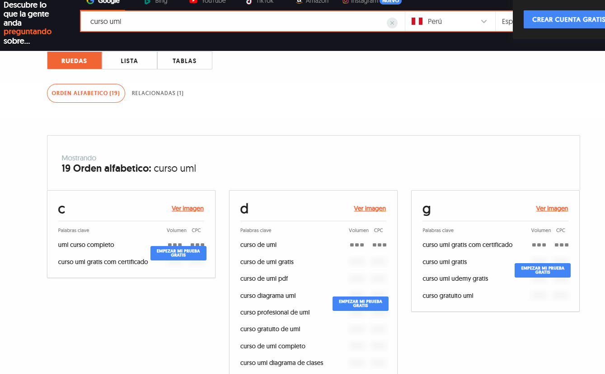

# 1. INTENCIONES DE BUSQUEDA E INVESTIGACIÓN DE PALABRAS CLAVE.

## 1.1. Bienvenida

## 1.2. Por que es importante la intencion de la busqueda en SEO

El usuario es el centro, mostrandole la informacion que sea relevente para él.

Los sitios web se van a posicionar de acuerdo a la informacion que contengan y la busqueda del usuario, si hay coincidencia en palabras, lo mas probable que nuestro sitio web este entre las primeras opciones

## 1.3. Que es la intencion de busqueda
## 1.4. Intenciones de busqueda básicas

Intenciones de busqueda básicas

    - Informativa: Cuando alguien quiere aprender sobre algo. Ejemplo: "¿Qué es el SEO?"

    - Navegacional: Cuando alguien busca una página específica. Ejemplo: "Página oficial de WordPress".

    - Comercial: Cuando alguien está investigando antes de comprar. Ejemplo: "Mejor hosting para WordPress 2024"

    - Transaccional: Cuando alguien ya quiere comprar o realizar una acción. Ejemplo: "Comprar dominio en Namecheap"

Básicamente, la intención de búsqueda refleja en qué etapa está el usuario: desde aprender hasta tomar acción.

## 1.5. Como interpretar facilmente las intenciones de busqueda

Los micromomentos de Google son situaciones en las que una persona usa su celular u otro dispositivo para satisfacer una necesidad inmediata. Google los divide en cuatro tipos:

*Micromomentos de Google*

    Quiero saber: Cuando alguien busca información. Ejemplo: "¿Cómo funciona el SEO?"

    Quiero ir: Cuando alguien busca un lugar cercano. Ejemplo: "Restaurantes cerca de mí"

    Quiero hacer: Cuando alguien busca cómo hacer algo. Ejemplo: "Cómo instalar un plugin en WordPress"

    Quiero comprar: Cuando alguien está listo para comprar algo. Ejemplo: "Mejor hosting barato para WordPress"

Estos micromomentos son clave para entender el comportamiento de los usuarios y crear estrategias de SEO efectivas.

# 1.6. Como elegir palabras clave con potencial de posicionamiento

**PRIMERA OPCION: BUSQUEDA EN GOOGLE**

**USANDO KEYWORD TOOL**

https://keywordtool.io/

**USANDO ANSWRD THE PUBLIC**

https://answerthepublic.com/

# 1.7. Recomendaciones y estrategias avanzadas.

Podemos usar en el navegador busquedas como:

    allinurl: curso uml
    intext: curso uml

