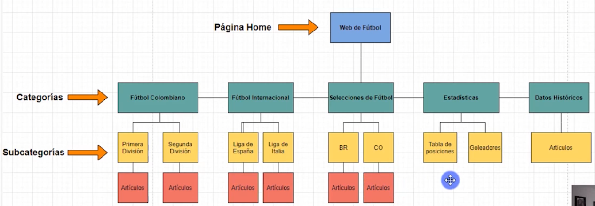
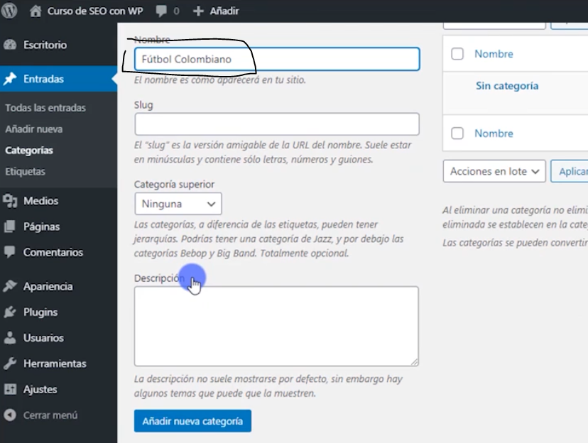
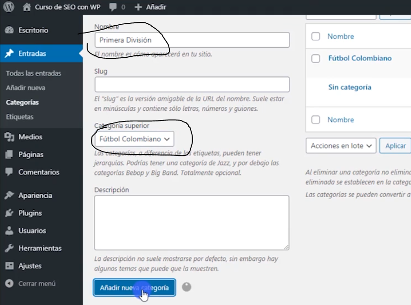
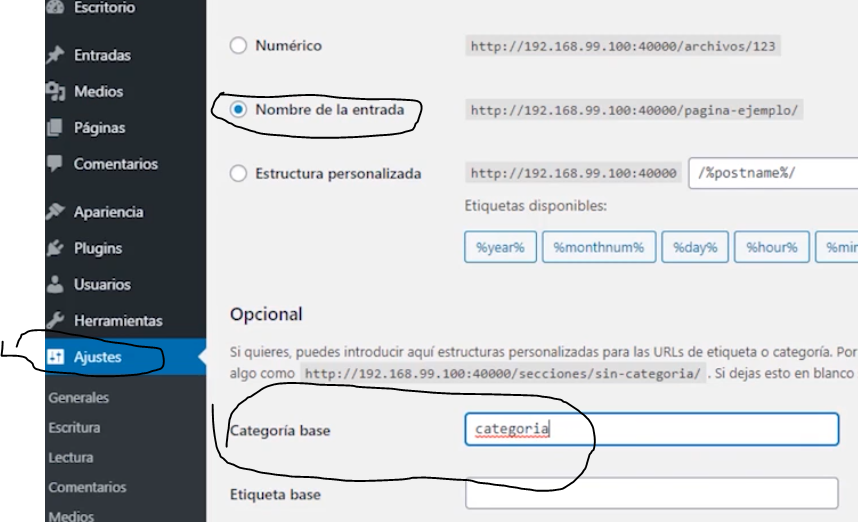
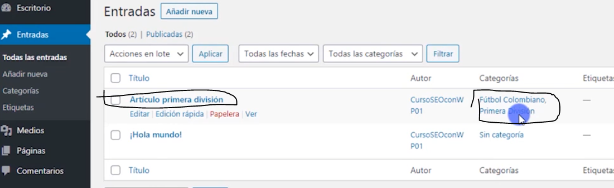
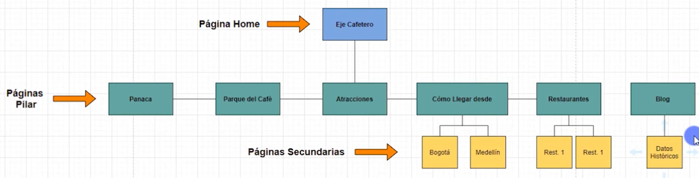

# 2. CONSTRUYENDO LA ARQUITECTURA DE LA INFORMACION DE TU SITIO WEB EN WORDPRESS

## 2.1. Crea arquitectura de la informacion con categorias y subcategorias (contenido dinamico)

Creando una categoria en wp:

Creando una subcategoria en wp

A partir de ahi podemos agregar entradas o articulos, configurando los enlaces permanentes

No es recomendable que os articulos tengan asignados varias categorias , pero en nuestro ejemplo se muestran 2 categorias debido a que una es subcategoria de su padre.

## 2.2. Crea arquitectura de la informacion con paginas(contenido estático)

Luego de crear las paginas principales en wp creamos las subpaginas y le indicamos su categoria padre o principal

## 2.3. Como ubicar la informacion en el sitio web de acuerdo a su  relevancia

Es importante saber donde colocar la informacion importante, palabras claves relevantes. Y lo recomendable para ubicar ello es en la Pagina home y en el menu superior o de navegacion

A continuacion colocaremos un menu de navegacion, agregamos todos nuestros elementos al menu y luego lo configuramos para que en el menu se muestren desplegables por categoria

Lo mismo hacemos para el otro ejemplo

