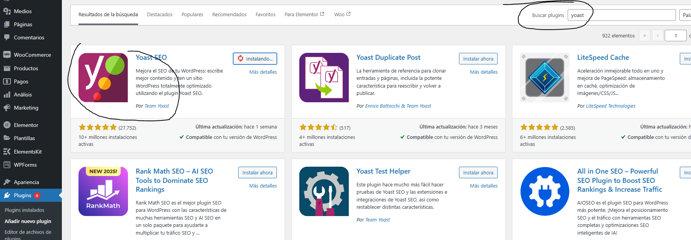
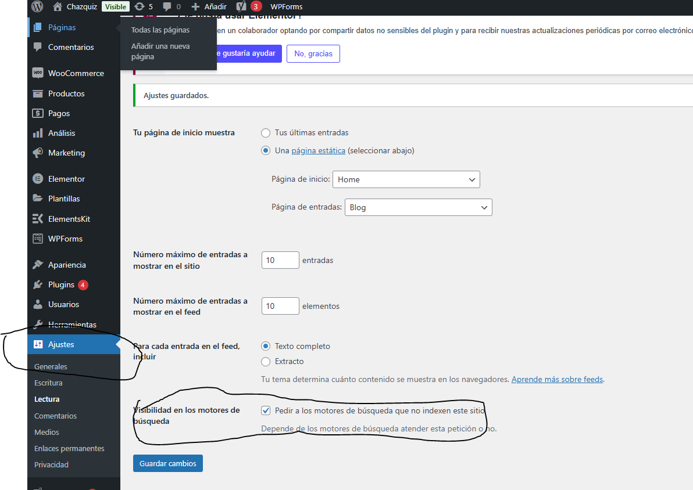
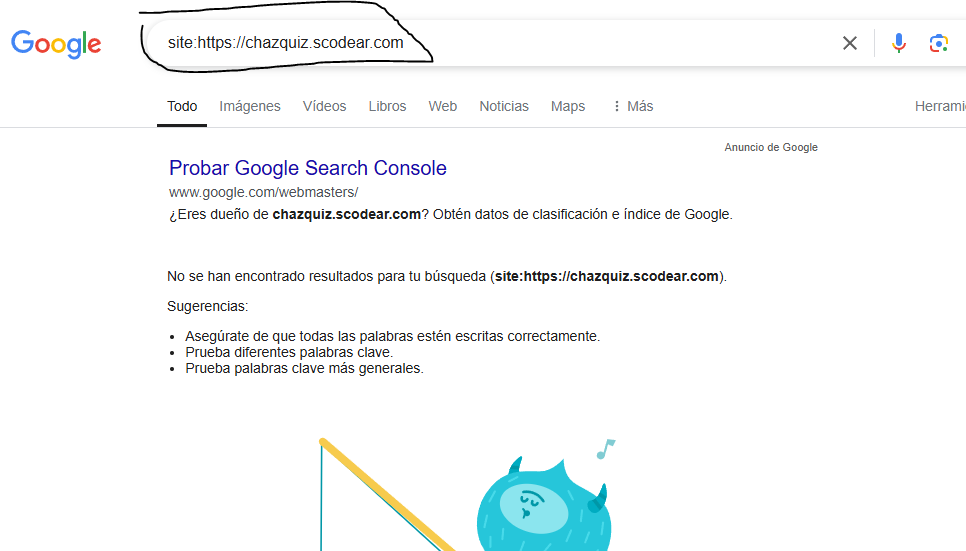

# 3. HERRAMIENTAS BASICAS PARA MONITOREAR EL SEO EN WORDPRESS

## 3.1. Introduccion a las herramientas basicas

    - Yoast
    - Google Analytics
    - Google Search Console

# 3.2. Instalar y configurar plugin yoast

Instalamos el plugin yoast seo

Cuando vamos a modificar o agregar algo a nuestro sitio web que ya esta en produccion, es importante  marcar la siguiente informacion para que no se indexe en google contenido de prueba

Al bloquearlo podemos verificar poniendo

site:dominio de tu pagina

Cuando ya se termine nuevamente la fase de prueba y quieres volver a produccion, entonces debes desmarcar el cuadro de "Disuadir a los motores de busqueda"

# 3.3. Apariencia en el buscador
# 3.4. Configurar nuestras redes sociales
# 3.5. Usando Google Analytics

# 3.6. Verificar propiedad en Google Search console

Uso de Google Analytics (Tag Manager)
Uso de Google Console